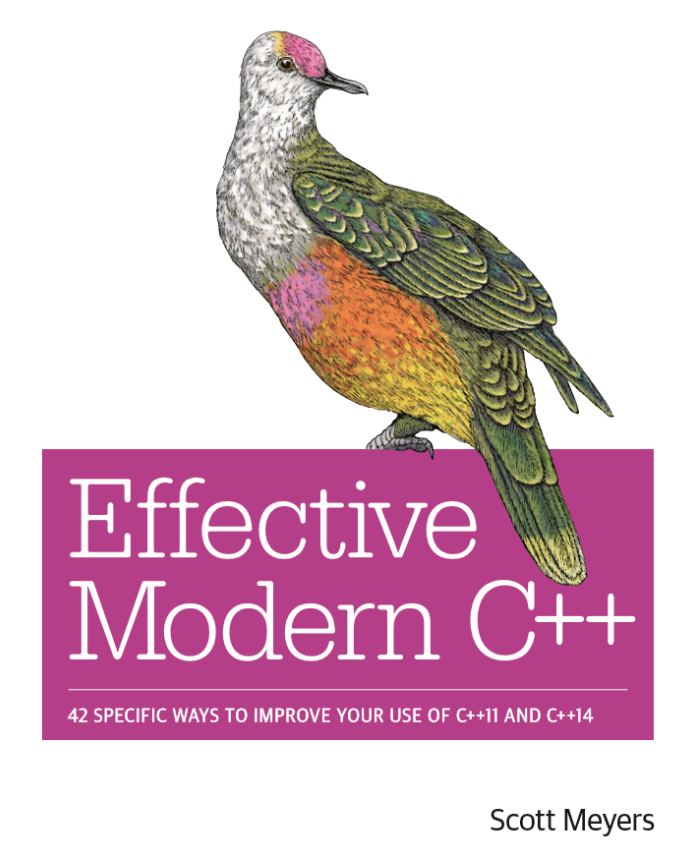

<svg xmlns="http://www.w3.org/2000/svg" xmlns:xlink="http://www.w3.org/1999/xlink" version="1.1" width="100%" height="100%" viewbox="0 0 694 854" preserveaspectratio="xMidYMid">
<image width="694" height="854" xlink:href="../media/1.png"></image>
</svg>

# 《Effective Modern C++ 》翻译

<!--   -->

> ! 2017.10 开始更新  
> ! 标注“已修订”的章节表示已经没有大致的错误  
> ! 我没有版权，我没有版权，我没有版权  
> ! 本书要求读者具有 C++基础  
> ! 未翻译的条款名称现在直译，翻译时可能适当修改  
> !
> [PDF 格式英文版下载](https://github.com/CnTransGroup/EffectiveModernCppChinese/blob/master/0.Public/EffectiveModernCpp.pdf),仅供翻译参考

## 目录

1.  [**简介**](#ch001.xhtml#简介)
2.  **类型推导**
    1.  [Item 1:理解模板类型推导](#ch002.xhtml#item-01) 已修订
    2.  [Item 2:理解 auto 类型推导](#ch002.xhtml#item-02)
    3.  [Item 3:理解 decltype](#ch002.xhtml#item-03)
    4.  [Item 4:学会查看类型推导结果](#ch002.xhtml#item-04)
3.  **auto**
    1.  [Item 5:优先考虑 auto 而非显式类型声明](#ch003.xhtml#item-05)
    2.  [Item
        6:auto 推导若非己愿，使用显式类型初始化惯用法](#ch003.xhtml#item-06)
4.  **移步现代 C++**
    1.  [Item 7:区别使用()和{}创建对象](#ch004.xhtml#item-07)
    2.  [Item 8:优先考虑 nullptr 而非 0 和 NULL](#ch004.xhtml#item-08)
    3.  [Item 9:优先考虑别名声明而非 typedefs](#ch004.xhtml#item-09)
    4.  [Item 10:优先考虑限域枚举而非未限域枚举](#ch004.xhtml#item-10)
        已修订
    5.  [Item
        11:优先考虑使用 deleted 函数而非使用未定义的私有声明](#ch004.xhtml#item-11)
    6.  [Item 12:使用 override 声明重载函数](#ch004.xhtml#item-12)
    7.  [Item
        13:优先考虑 const_iterator 而非 iterator](#ch004.xhtml#item-13)
    8.  [Item 14:如果函数不抛出异常请使用 noexcept](#ch004.xhtml#item-14)
    9.  [Item 15:尽可能的使用 constexpr](#ch004.xhtml#item-15)
    10. [Item 16:让 const 成员函数线程安全](#ch004.xhtml#item-16) 由 @windski 贡献
    11. [Item 17:理解特殊成员函数函数的生成](#ch004.xhtml#item-17)
5.  **智能指针**
    1.  [Item 18:对于独占资源使用 std::unique_ptr](#ch005.xhtml#item-18)
        由 @wendajiang 贡献
    2.  [Item 19:对于共享资源使用 std::shared_ptr](#ch005.xhtml#item-19)
        已修订
    3.  [Item
        20:当 std::shard_ptr 可能悬空时使用 std::weak_ptr](#ch005.xhtml#item-20)
        更新完成
    4.  [Item
        21:优先考虑使用 std::make_unique 和 std::make_shared 而非 new](#ch005.xhtml#item-21)
        由 @pusidun 贡献
    5.  [Item
        22:当使用 Pimpl 惯用法，请在实现文件中定义特殊成员函数](#ch005.xhtml#item-22)
        由 @BlurryLight 贡献
6.  **右值引用，移动语义，完美转发**
    1.  [Item 23:理解 std::move 和 std::forward](#ch006.xhtml#item-23) 由
        @BlurryLight 贡献
    2.  [Item 24:区别通用引用和右值引用](#ch006.xhtml#item-24) 由 @BlurryLight 贡献
    3.  [Item
        25:对于右值引用使用 std::move，对于通用引用使用 std::forward](#ch006.xhtml#item-25)由
        @wendajiang 贡献
    4.  [Item 26:避免重载通用引用](#ch006.xhtml#item-26) 由 @wendajiang 贡献
    5.  [Item 27:熟悉重载通用引用的替代品](#ch006.xhtml#item-27) 由
        @wendajiang 贡献
    6.  [Item 28:理解引用折叠](#ch006.xhtml#item-28) 由 @wendajiang 贡献
    7.  [Item 29:认识移动操作的缺点](#ch006.xhtml#item-29) 由 @wendajiang 贡献
    8.  [Item 30:熟悉完美转发失败的情况](#ch006.xhtml#item-30) 由 @wendajiang 贡献
7.  **Lambda 表达式**
    1.  [Item 31:避免使用默认捕获模式](#ch007.xhtml#item-31) 由 @LucienXian 贡献
    2.  [Item 32:使用初始化捕获来移动对象到闭包中](#ch007.xhtml#item-32)
        由 @LucienXian 贡献
    3.  [Item
        33:对于 std::forward 的 auto&&形参使用 decltype](#ch007.xhtml#item-33)
        由 @LucienXian 贡献
    4.  [Item
        34:优先考虑 lambda 表达式而非 std::bind](#ch007.xhtml#item-34) 由
        @LucienXian 贡献
8.  **并发 API**
    1.  [Item
        35:优先考虑基于任务的编程而非基于线程的编程](https://github.com/kelthuzadx/EffectiveModernCppChinese/blob/master/7.TheConcurrencyAPI/Item35.md)
        由 @wendajiang 贡献
    2.  [Item
        36:如果有异步的必要请指定 std::launch::threads](#ch008.xhtml#item-36)
        由 @wendajiang 贡献
    3.  [Item 37:从各个方面使得 std::threads
        unjoinable](#ch008.xhtml#item-37) 由 @wendajiang 贡献
    4.  [Item 38:关注不同线程句柄析构行为](#ch008.xhtml#item-38) 由
        @wendajiang 贡献
    5.  [Item 39:考虑对于单次事件通信使用 void](#ch008.xhtml#item-39) 由
        @wendajiang 贡献
    6.  [Item
        40:对于并发使用 std::atomic，volatile 用于特殊内存区](#ch008.xhtml#item-40)
        由 @wendajiang 贡献
9.  **微调**
    1.  [Item
        41:对于那些可移动总是被拷贝的形参使用传值方式](#ch009.xhtml#item-41)
        由 @wendajiang 贡献
    2.  [Item 42:考虑就地创建而非插入](#ch009.xhtml#item-42) 由 @wendajiang 贡献

## 其他资源

- 本书[PDF 格式的中文版](https://github.com/CnTransGroup/EffectiveModernCppChinese/blob/master/0.Public/translated/translate-zh-combine.pdf)见于此，该版本通常同步或者滞后于当前 Markdown 文档
- [Effective C++ Xmind
  Doc](https://github.com/CnTransGroup/EffectiveModernCppChinese/blob/master/0.Public/EffectModernC++.xmind)

## 贡献者

感谢所有参与翻译/勘误/建议的贡献者们~

## 赞助翻译

🙏 \[[Become a
backer](https://opencollective.com/EffectiveModernCppChinese#backer)\]

<!--  -->

## 简介

如果你是一个有经验的 C++程序员，像我一样，你在初次接触 C++11 时候会想：“是啊是啊，我明白了。这也是 C++，就多了点东西罢了。”但是你接触越多，你会惊讶于改变如此之多。`auto`声明，范围`for`循环，*lambda*表达式，还有右值引用都改变了 C++的面貌，不过没有新的并发特性。还有一些地道的表达方式的改变。`0`和`typedef`被请出去了，`nullptr`和别名声明加进来了。枚举现在应该是限域的了。应该更倾向于智能指针而不是原始指针了。移动对象通常比拷贝它们要好了。

有很多 C++11 的东西要学，先不提 C++14 了。

更重要的是，要学习怎样**高效地**使用新机能。如果你需要关于”现代“C++的特性的基础信息，学习资源有很多，但是你想找一些指南，教你怎样应用这些特性来写出正确、高效、可维护、可移植的程序，那就相当有挑战性了。这就是这本书的切入点。它不致力于介绍 C++11 和 C++14 的特性，而致力于它们的高效应用。

书中这些信息被打碎成不同指导方针，称为**条款**。想理解类型推导的不同形式？或者想知道什么时候该用（或者不该用）`auto`声明？你对为什么`const`成员函数应当线程安全，怎样使用`std::unique_ptr`实现 Pimpl 惯用法，为何要避免*lambda*表达式用默认捕获模式，或者`std::atomic`与`volatile`的区别感兴趣吗？答案都在这里。而且，答案无关于平台，顺应于标准。这本书是关于**可移植**C++的。

本书的条款是**指导方针**，而不是**规则**，因为指导方针也有例外。每个条款中最关键的部分不是提出的建议，而是建议背后的基本原理。一旦你阅读了它，你就明白你的程序的情况是否违反了条款的指导意见。本书的真正目的不是告诉你应该做什么不应该做什么，而是帮你深入理解 C++11 和 C++14 中各种东西是如何工作的。

### 术语和惯例

为了保证我们互相理解，对一些术语达成共识非常重要，首先有点讽刺的是，“C++”。有四个 C++官方版本，每个版本名字后面带有相应 ISO 标准被采纳时的年份：C++98，C++03，C++11 和 C++14。C++98 和 C++03 只有技术细节上的区别，所以本书统称为 C++98。当我提到 C++11 时，我的意思是 C++11 和 C++14，因为 C++14 是 C++11 的超集，当我写下 C++14，我只意味着 C++14。如果我仅仅提到 C++，说明适用于所有的语言版本。

我使用的词 我意思中的语言版本

---

C++ 所有版本
C++98 C++98 和 C++03
C++11 C++11 和 C++14
C++14 C++14

因此，我可能会说 C++重视效率（对所有版本正确），C++98 缺少并发的支持（只对 C++98 和 C++03 正确），C++11 支持*lambda*表达式（对 C++11 和 C++14 正确），C++14 提供了普遍的函数返回类型推导（只对 C++14 正确）。

最遍布 C++11 各处的特性可能是移动语义了，移动语义的基础是区分右值和左值表达式。那是因为右值表明这个对象适合移动操作，而左值一般不适合。概念上（尽管不经常在实际上用），右值对应于从函数返回的临时对象，而左值对应于你可以引用的（can
refer to）对象，或者通过名字，或者通过指针或左值引用。

对于判断一个表达式是否是左值的一个有用的启发就是，看看能否取得它的地址。如果能取地址，那么通常就是左值。如果不能，则通常是右值。这个启发的好处就是帮你记住，一个表达式的类型与它是左值还是右值无关。也就是说，有个类型`T`，你可以有类型`T`的左值和右值。当你碰到右值引用类型的形参时，记住这一点非常重要，因为形参本身是个左值：

    class Widget {
    public:
        Widget(Widget&& rhs);   //rhs是个左值，
        …                       //尽管它有个右值引用的类型
    };

在这里，在`Widget`移动构造函数里取`rhs`的地址非常合理，所以`rhs`是左值，尽管它的类型是右值引用。（由于相似的原因，所有形参都是左值。）

那一小段代码揭示了我通常遵循的惯用法：

- 类的名字是`Widget`。每当我想指代任意的用户定义的类型时，我用`Widget`来代表。除非我需要展示类中的特定细节，否则我都直接使用`Widget`而不声明它。

- 我使用形参名`rhs`（“right-hand
  side”）。这是我喜欢的**移动操作**（即移动构造函数和移动赋值运算符）和**拷贝操作**（拷贝构造函数和拷贝赋值运算符）的形参名。我也在双目运算符的右侧形参用它：

      Matrix operator+(const Matrix& lhs, const Matrix& rhs);

  我希望你并不奇怪，我用`lhs`表示“left-hand side”。

- 我在部分代码或者部分注释用特殊格式来吸引你的注意。（译者注：但是因为 markdown 没法在代码块中表明特殊格式，即原书使用的颜色改变和斜体注释，所以大部分情况下只能作罢，少部分地方会有额外说明。）在上面`Widget`移动构造函数中，我高亮了`rhs`的声明和“`rhs`是个左值”这部分注释。高亮代码不代表写的好坏。只是来提醒你需要额外的注意。

- 我使用“`…`”来表示“这里有一些别的代码”。这种窄省略号不同于 C++11 可变参数模板源代码中的宽省略号（“`...`”）。这听起来不太清楚，但实际并不。比如：

      template<typename... Ts>                //这些是C++源代码的
      void processVals(const Ts&... params)   //省略号
      {
          …                                   //这里意思是“这有一些别的代码”
      }

  `processVals`的声明表明在声明模板的类型形参时我使用`typename`，但这只是我的个人偏好；关键字`class`可以做同样的事情。在我展示从 C++标准中摘录的代码的情况下，我使用`class`声明类型形参，因为那就是标准中的做法。

当使用另一个同类型的对象来初始化一个对象时，新的对象被称为是用来初始化的对象（译者注：initializing
object，即源对象）的一个**副本**（_copy_），尽管这个副本是通过移动构造函数创建的。很抱歉地说，C++中没有术语来区别一个对象是拷贝构造的副本还是移动构造的副本（译者注：此处为了区别拷贝这个“动作”与拷贝得到的“东西”，将*copy*按语境译为拷贝（动作）和副本（东西），此处及接下来几段按此方式翻译。在后面的条款中可能会不加区别地全部翻译为“拷贝”。）：

    void someFunc(Widget w);        //someFunc的形参w是传值过来

    Widget wid;                     //wid是个Widget

    someFunc(wid);                  //在这个someFunc调用中，w是通过拷贝构造函数
                                    //创建的副本

    someFunc(std::move(wid));       //在这个someFunc调用中，w是通过移动构造函数
                                    //创建的副本

右值副本通常由移动构造产生，左值副本通常由拷贝构造产生。如果你仅仅知道一个对象是其他对象的副本，构造这个副本需要花费多大代价是没法说的。比如在上面的代码中，在不知道是用左值还是右值传给`someFunc`情况下，没法说来创建形参`w`花费代价有多大。（你必须还要知道移动和拷贝`Widget`的代价。）

在函数调用中，调用地传入的表达式称为函数的**实参**（_argument_）。实参被用来初始化函数的**形参**（_parameter_）。在上面第一次调用`someFunc`中，实参为`wid`。在第二次调用中，实参是`std::move(wid)`。两个调用中，形参都是`w`。实参和形参的区别非常重要，因为形参是左值，而用来初始化形参的实参可能是左值或者右值。这一点尤其与**完美转发**（_perfect
forwarding_）过程有关，被传给函数的实参以原实参的右值性（_rvalueness_）或左值性（_lvalueness_），再被传给第二个函数。（完美转发讨论细节在[Item30](#ch006.xhtml#item-30)。）

设计优良的函数是**异常安全**（_exception
safe_）的，意味着他们至少提供基本的异常安全保证（即基本保证*basic
guarantee*）。这样的函数保证调用者在异常抛出时，程序不变量保持完整（即没有数据结构是毁坏的），且没有资源泄漏。有强异常安全保证的函数确保调用者在异常产生时，程序保持在调用前的状态。

当我提到“**函数对象**”时，我通常指的是某个支持`operator()`成员函数的类型的对象。换句话说，这个对象的行为像函数一样。偶尔我用稍微更普遍一些的术语，表示可以用非成员函数语法调用的任何东西（即“`fuctionName(arguments)`”）。这个广泛定义包括的不仅有支持`operator()`的对象，还有函数和类似 C 的函数指针。（较窄的定义来自于 C++98，广泛点的定义来自于 C++11。）将成员函数指针加进来的更深的普遍化产生了我们所知的**可调用对象**（_callable
objects_）。你通常可以忽略其中的微小区别，简单地认为函数对象和可调用对象为 C++中可以用函数调用语法调用的东西。

通过*lambda*表达式创建的函数对象称为**闭包**（_closures_）。没什么必要去区别*lambda*表达式和它们创建的闭包，所以我经常把它们统称*lambdas*。类似地，我几乎不区分**函数模板**（_function
templates_）（即产生函数的模板）和**模板函数**（_template
functions_）（即从函数模板产生的函数）。**类模板**（_class
templates_）和**模板类**（_template classes_）同上。

C++中的许多东西都可被声明和定义。**声明**（_declarations_）引入名字和类型，并不给出比如存放在哪或者怎样实现等的细节：

    extern int x;                       //对象声明

    class Widget;                       //类声明

    bool func(const Widget& w);         //函数声明

    enum class Color;                   //限域enum声明（见条款10）

**定义**（_definitions_）提供存储位置或者实现细节：

    int x;                              //对象定义

    class Widget {                      //类定义
        …
    };

    bool func(const Widget& w)
    { return w.size() < 10; }           //函数定义

    enum class Color
    { Yellow, Red, Blue };              //限域enum定义

定义也有资格称为声明，所以我倾向于只有声明，除非这个东西有个定义非常重要。

我定义一个函数的**签名**（_signature_）为它声明的一部分，这个声明指定了形参类型和返回类型。函数名和形参名不是签名的一部分。在上面的例子中，`func`的签名是`bool(const Widget&)`。函数声明中除了形参类型和返回类型之外的元素（比如`noexcept`或者`constexpr`，如果存在的话）都被排除在外。（`noexcept`和`constexpr`在[Item14](#ch004.xhtml#item-14)和[15](#ch004.xhtml#item-15)叙述。）“签名”的官方定义和我的有点不一样，但是对本书来说，我的定义更有用。（官方定义有时排除返回类型。）

新的 C++标准保持了旧标准写的代码的有效性，但是偶尔标准化委员会**废弃**（_deprecate_）一些特性。这些特性在标准化的“死囚区”中，可能在未来的标准中被移除。编译器可能警告也可能不警告这些废弃特性的使用，但是你应当尽量避免使用它们。它们不仅可能导致将来对移植的头痛，也通常不如来替代它们的新特性。例如，`std::auto_ptr`在 C++11 中被废弃，因为`std::unique_ptr`可以做同样的工作，而且只会做的更好。

有时标准说一个操作的结果有**未定义的行为**（_undefined
behavior_）。这意味着运行时表现是不可预测的，不用说你也想避开这种不确定性。有未定义行为的行动的例子是，在`std::vector`范围外使用方括号（“`[]`”），解引用未初始化的迭代器，或者引入数据竞争（即有两个或以上线程，至少一个是 writer，同时访问相同的内存位置）。

我将那些比如从`new`返回的内置指针（_build-in
pointers_）称为**原始指针**（_raw
pointers_）。原始指针的“反义词”是**智能指针**（_smart
pointers_）。智能指针通常重载指针解引用运算符（`operator->`和`operator*`），但在[Item20](#ch005.xhtml#item-20)中解释看`std::weak_ptr`是个例外。

在源代码注释中，我有时将“constructor”（构造函数）缩写为`ctor`，将“destructor”（析构函数）缩写为`dtor`。（译者注：但译文中基本都完整翻译了而没使用缩写。）

### 报告 bug，提出改进意见

我尽力将本书写的清晰、准确、富含有用的信息，但是当然还有些去做得更好的办法。如果你找到了任何类型的错误（技术上的，叙述上的，语法上的，印刷上的等），或者有些建议如何改进本书，请给我发电子邮件到 emc++@aristeia.com。新的印刷给了我改进《Modern
Effective C++》的机会，但我也不能解决我不知道的问题！

要查看我所知道的事情，参见本书勘误表页，http://www.aristeia.com/BookErrata/emc++-errata.html
。

